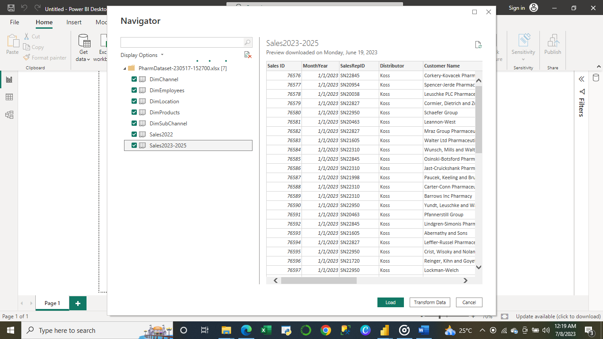
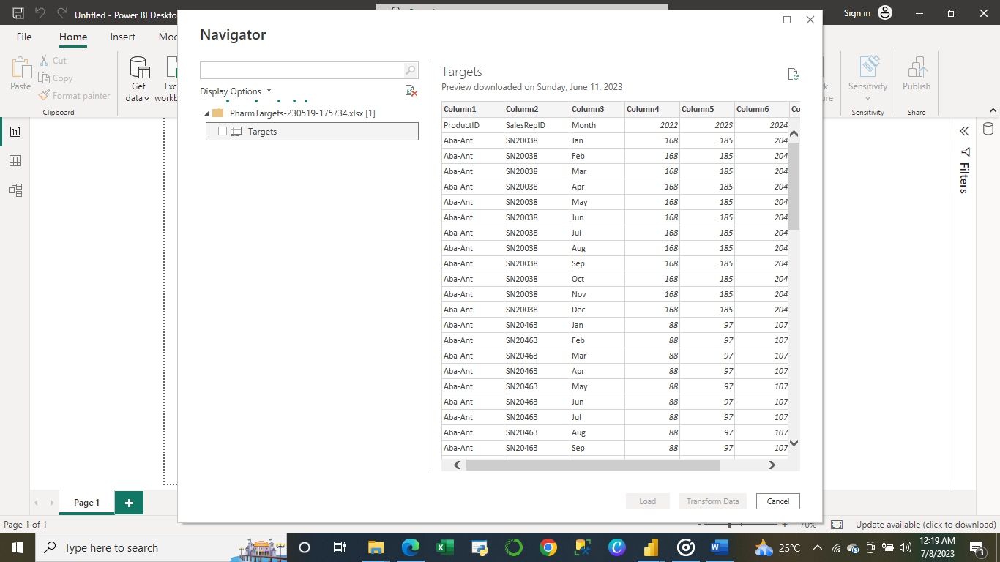
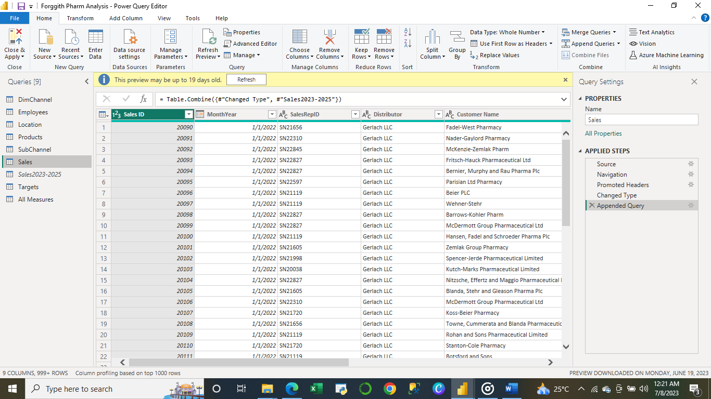
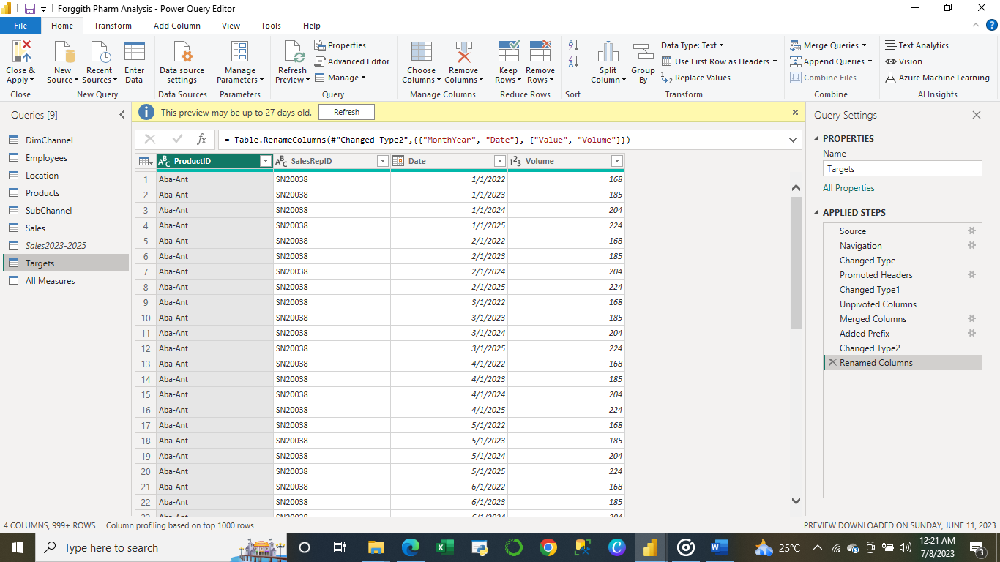
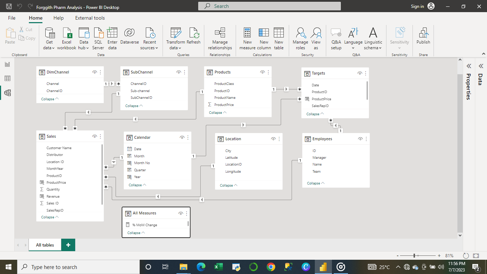
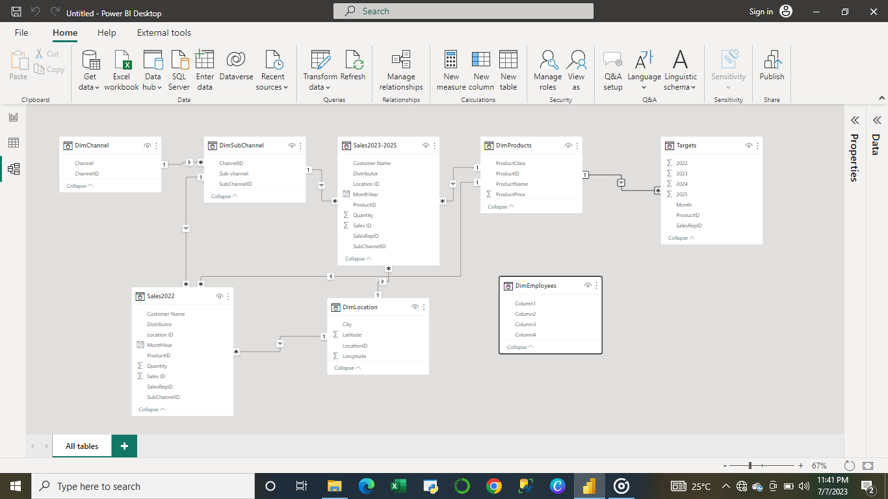

# Forggith-Pharmaceuticals-Report

---
## Introduction
This project is a task carried out during my one month Power BI Developer internship with **Foresight BI & Analytics**. It is a report for a pharmaceutical company called **Forggith Pharmaceuticals**. Forggith Pharmaceuticals (Forggith) is a Pharmaceutical Manufacturing company based in Germany. As a Manufacturing company, they produce medical drugs that get to consumers through their Distributors. This project is to analyze and derive insights into performance of different sectors by various categories and time periods. It is to help the Sales Representatives track their performances throughout the period to plan their marketing activities. It is also to assist the Team Managers in tracking their teams' performances throughout the periods to plan their teams' activities, and it is also for the Executive team to use to be able to track Revenue numbers to monitor alignment with the set targets to influence medium- to long-term strategies.
## Problem Statement
### Sales Performance ###
1. Total  Revenue
2. Total Revenue Year To Date (YTD)
3. Total Revenue Previous Year YTD
4. Total Revenue Same Period Last Year(SPLY)
5. Total Target
6. Total TargetYTD
7. Actual Revenue Performance Previous Year YTD vs Target Previous Year YTD
8. Actual Revenue Performance YTD vs Target YTD
9. Revenue Month on Month Percentage Change
10. Revenue Distribution by Location
11. Revenue by Channel
12. Revenue by Product Class
### Marketing Performance ###
1. Revenue Achieved vs Revenue Target
2. Volume Achieved vs Volume Target
3. Actual Revenue by Sales Representative
4. Target Revenue Achievement% by Sales Representative
5. Actual Volume by Sales Representative
6. Target Volume Achievement by Sales Representative
7. Actual Revenue Achievement by Sales Team
8. Revenue and Volume Achievement by Product.
## Skills/Concepts Demonstrated
The following Power BI features were incorporated:
- Power Query for transformation
- Bookmarking
- DAX
- Quick measures
- Page navigation
- Modelling
- Filters
- Tooltips
- Button
## Data Sourcing
The data was sourced from the **Foresight BI & Analytics** team since it was an internship program. 

Forggith-Pharmaceuticals-Report database tables - PharmDatasets and PharmTargets
The following tables were selected from the dataset to be used for the analysis
1. Channel Table
2. Employees Table
3. Location Table
4. Products Table
5. Sales Table
6. Subchannel Table
7. Targets Table
### PharmDatasets
 
### PharmTargets

## Data Transformation
- For all the tables, the first rows were changed to become Headers.
- In the Sales Table, the data type for the "MonthYear" column was changed to Date. I also appended queries for the "2023-2025" sales table to the "2022" sales table and named it "Sales"

- In the Targets Table, I unpivoted the year columns, then I merged the month and the year column together. I also changed the data type to Date and renamed it as "Date"

## Data Modelling
Automatically derived relationships are adjusted to remove and replace unwanted relationships with the required.

Adjusted Model          |           Auto-model
:----------------------:|:----------------------:
 |  

The model is a star schema.
There are 5-dimension tables and 2 fact tables. The dimension tables are all joined to the fact tables with a many-to-one relationship.

## Visualization
The report comprises of 3 pages:
1. Overview (Home)
2. Sales Report
3. Marketing Report

You can interact with the report [here](https://app.powerbi.com/view?r=eyJrIjoiNGY1MTkzNTUtM2UwNi00NmNmLTg5M2MtMzFjNDc0YTg4YjI0IiwidCI6IjVkMmExNjk0LWNiNzAtNDJlYi04MmNhLTRmMjBlMWMyODFmMSJ9)

## Analysis
### Overview/Home Page: 

- Has a Date filter that filters through 2022 - 2025.
- The three tabs at the top are buttons with hovering effects and each navigates through to the pages with similar name.
- Total of 27 million products were sold.
- Total revenue generated was $11.12 billion.
- Total profits made within the time period is $90,752
### Product page: 

- There is a table showing Production details by class, color, style and name by size and profits made.
- There is a chart displaying top products with high revenues.
- There are 304 sellable products in total.
### Work Order page: 

- BB Ball bearing is the most ordered product with a total of 911.89k quantitites ordered.
- Mountain-100 Silver gave the highest revenue with each yielding profits of $1,488.
### Work Order Routing Page: 

- Touring line had the highest average spent hours in production.
### Date: 

- The highest revenue was generated in 2011 with a total of $37,465.

## Conclusion
- Road line has the highest impact on revenue generated.
- 2011 was the most productive year. 🤑

Features
- Has a Date and Production line filter.
- The four tabs at the top are buttons with hovering effects and each navigates through to the pages with similar name.

